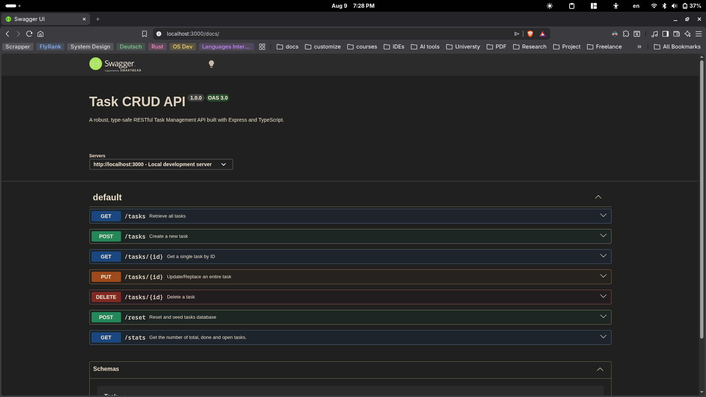

# Internship-CRUD-Backend

A robust, type-safe RESTful CRUD (Create, Read, Update, Delete) Backend API built with **TypeScript**, **Node.js**, and **Express**. This project features an in-memory database configuration with strict data validation, accurate HTTP response codes, defensive error boundaries, and interactive Swagger API documentation.

---

## 🚀 Getting Started

Follow this single, chained command to clean up previous environments, install all dependencies using `pnpm`, and fire up the hot-reloading development server:

```bash
pnpm install && pnpm dev

```

*Note: Make sure your terminal is opened in the project root directory before executing.*

---

## 🗺️ API Endpoints Reference

The API uses standardized HTTP status codes (`200 OK`, `201 Created`, `204 No Content`, `400 Bad Request`, `404 Not Found`, `401 Unauthorized`) to handle all transactional states.

| Method | Endpoint | Description | Payload Constraints | Success | Errors |
| --- | --- | --- | --- | --- | --- |
| **GET** | `/` | Root Metadata API details | None | `200 OK` | N/A |
| **GET** | `/health` | Server status checker | None | `200 OK` | N/A |
| **GET** | `/tasks` | Fetches all current tasks | None | `200 OK` | N/A |
| **GET** | `/tasks/:id` | Fetches a single task by ID | Requires valid numeric `id` | `200 OK` | `400 Bad Request`, `404 Not Found` |
| **POST** | `/tasks` | Creates a new task item | `{"title": "string"}` (Non-empty) | `201 Created` | `400 Bad Request` |
| **PUT** | `/tasks/:id` | Replaces/updates a task fully | `{"title": "string", "done": boolean}` | `200 OK` | `400 Bad Request`, `404 Not Found` |
| **DELETE** | `/tasks/:id` | Safely removes a task by ID | Requires valid numeric `id` | `204 No Content` | `400 Bad Request`, `404 Not Found` |
| **POST** | `/reset` | Resets tasks to initial seed data | None | `200 OK` | N/A |
| **GET** | `/stats` | Gets task statistics (total, done, open) | None | `200 OK` | N/A |
| **POST** | `/auth/signup` | Registers a new user | `{"email": "string", "password": "string"}` | `201 Created` | `400 Bad Request` |
| **POST** | `/auth/login` | Authenticates user and returns JWT tokens | `{"email": "string", "password": "string"}` | `200 OK` | `400 Bad Request`, `401 Unauthorized` |
| **POST** | `/auth/logout` | Signs out the authenticated user | `Bearer <access_token>` | `204 No Content` | `401 Unauthorized` |
| **GET** | `/public/info` | Fetches public information | None | `200 OK` | N/A |
| **GET** | `/protected/profile` | Fetches authenticated user profile | `Bearer <access_token>` | `200 OK` | `401 Unauthorized` |
| **GET** | `/protected/dashboard` | Fetches authenticated user email for dashboard | `Bearer <access_token>` | `200 OK` | `401 Unauthorized` |

---

## 🧪 Curl Execution Output Examples

### Testing Validation: Passing an Incorrect/Empty Input String

When executing a request with a malformed layout, or an empty string/spaces scenario, the defensive schema validation catches the client error instantly before it runs through the business layer.

Command executed:

```powershell
curl -i -X POST http://localhost:3000/tasks -H "Content-Type: application/json" -d "{\"title\": \"\"}"

```

Server output response:

```http
HTTP/1.1 400 Bad Request
X-Powered-By: Express
Content-Type: application/json; charset=utf-8
Content-Length: 62
ETag: W/"3e-cK5uA5qK0eUq9t11a5vX3bA2eCg"
Date: Fri, 17 Jul 2026 07:11:42 GMT
Connection: keep-alive
Keep-Alive: timeout=5

{"error":"Title is required and must be a non-empty string."}

```

---

## 🎨 Interactive API Documentation (Swagger UI)

The API endpoints, request bodies, schemas, and defensive edge-cases are fully documented and interactively testable via the visual Swagger UI interface.

To view and execute live network hooks inside the dashboard, open your browser and navigate to:
👉 **`http://localhost:3000/api-docs`**

---

## Visualizing Your Swagger UI

When you open your local documentation endpoint, the layout will look like the following interactive dashboard. You can expand each colored endpoint section to quickly test successful operations and error handling workflows directly inside the UI:

